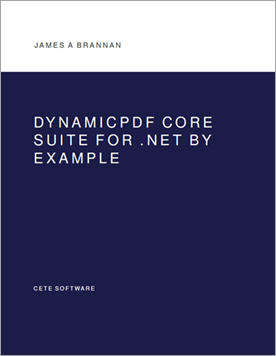

# DynamicPDF Core Suite for .NET by Example	

The following GitHub project contains the manuscript: **DynamicPDF Core Suite for .NET by Example** as a PDF Document and all related source-code for the book's examples.

* [DynamicPDF Core Suite for .NET by Example](https://github.com/DynamicPDF/core-suite-book/blob/main/DynamicPDF%20Core%20Suite%20for%20.NET%20By%20Example.pdf) - PDF

## About the Book

**The DynamicPDF Core Suite for .NET by Example** is a comprehensive guide to using DynamicPDF Core Suite for .NET, focusing on creating, modifying, and managing PDF documents through practical examples that help you master PDF generation and manipulation. Whether you are a beginner or an experienced developer, this book will help you master the art of PDF creation with confidence.

* In Part I, Creating PDF Documents, you explore the fundamentals
  of PDF creation, including document structure, adding pages, using
  coordinate systems, and integrating HTML layouts. Subsequent chapters
  discuss working with templates, sections, text, and how to incorporate
  vector graphics, images, and fonts into your PDF documents.
  Advanced topics include creating tables and charts, generating barcodes,
  and managing outlines and bookmarks. You also examine
  using security measures like encryption, digital signatures, and access
  control. Part I ends by discussing interactive forms, JavaScript,
  and event-based interactions.
* Part II, Modifying PDF Documents, covers modifying PDFs, merging
  documents, editing outlines, and working with forms.
* Part III, OtherTopics, covers additional topics, including custom
  components, report generation, and using DynamicPDF Designer for
  advanced document layout and automation.

## Table Of Contents

* 1 Introduction
  * 1.1 Essentials vs. Standard
  * 1.2 History
  * 1.3 Setup
  * 1.4 The Portable Document Format (PDF) by Adobe
  * 1.5 Creating Your First PDF
  * 1.6 Modifying Your First PDF
  * 1.7 Summary

**I Creating PDF Documents**

* 2 Documents
  * 2.1 Creating a Document
  * 2.2 Adding Pages
  * 2.3 Coordinate System
  * 2.4 HTML Layout
  * 2.5 Adding Document Properties
  * 2.6 Viewer Preferences
  * 2.7 Summary
* 3 Templates and Sections
  * 3.1 Applying Templates
  * 3.2 Sectioning Documents
  * 3.3 A Complete Example
  * 3.4 Summary
* 4 Text
  * 4.1 Page Elements Namespace
  * 4.2 Labels
  * 4.3 Text Area
  * 4.4 Formatted Text Area
  * 4.5 HTML Area
  * 4.6 Lists
  * 4.7 Notes
  * 4.8 Page Numbering Labels
  * 4.9 TextWatermark
  * 4.10 Link
  * 4.11 AutoLayout
  * 4.12 Summary
* 5 Vector Graphics
  * 5.1 Lines
  * 5.2 Rectangles
  * 5.3 Circles
  * 5.4 Paths
  * 5.5 AutoLayout
  * 5.6 Summary
* 6 Images
  * 6.1 Image
  * 6.2 Tiff Images
  * 6.3 BackgroundImage
  * 6.4 ImageWatermark
  * 6.5 Image3d
  * 6.6 AutoLayout
  * 6.7 Summary
* 7 Grouping
  * 7.1 ContentArea
  * 7.2 AreaGroup
  * 7.3 AnchorGroup
  * 7.4 TransformationGroup
  * 7.5 TransparencyGroup
  * 7.6 Summary
* 8 Fonts and Colors
  * 8.1 Fonts
  * 8.2 Colors
  * 8.3 Summary
* 9 Tables
  * 9.1 Creating
  * 9.2 Formatting
  * 9.3 Example Table
  * 9.4 AutoLayout
  * 9.5 Summary
* 10 Charts I
  * 10.1 Chart Elements
  * 10.2 Pie Charts
  * 10.3 Bar Chart
  * 10.4 Column Chart
  * 10.5 More on Charts
  * 10.6 AutoLayout
  * 10.7 Summary
* 11 Charts II
  * 11.1 Line Chart
  * 11.2 Area Chart
  * 11.3 Scatter Chart
  * 11.4 More on Charts
  * 11.5 Summary
* 12 Bar Codes
  * 12.1 UPC Code
  * 12.2 EAN Code
  * 12.3 QR Code
  * 12.4 Aztec Code
  * 12.5 AutoLayout
  * 12.6 Summary
* 13 Outlines and Bookmarks
  * 13.1 Outlines
  * 13.2 Outline Actions
  * 13.3 Bookmarks
  * 13.4 Summary
* 14 Securing PDF Documents
  * 14.1 Encrypting and Password Protecting
  * 14.2 Digitally Signing and Certifying
  * 14.3 Certificates
  * 14.4 Digitally Signing
  * 14.5 Summary
* 15 Creating Interactive Forms
  * 15.1 FormElement
  * 15.2 CheckBox
  * 15.3 Radio Buttons
  * 15.4 Text Fields
  * 15.5 List Boxes
  * 15.6 Combo Boxes
  * 15.7 Button
  * 15.8 Signature
  * 15.9 AutoLayout
  * 15.10Summary
* 16 Making PDFs Interactive
  * 16.1 Events
  * 16.2 Actions
  * 16.3 Summary
* 17 Using JavaScript
  * 17.1 Run-Time PDF Functionality
  * 17.2 DocumentJavaScript
  * 17.3 JavaScriptAction
  * 17.4 JavaScriptAction and DocumentJavaScript
  * 17.5 Summary
* 18 Submitting Forms
  * 18.1 Emailing a Form
  * 18.2 Submitting a Form
  * 18.3 Summary
* 19 Embedding and Portfolios
  * 19.1 Embedding Files
  * 19.2 Portfolios
  * 19.3 Summary
* 20 Accessibility
  * 20.1 PDF/UA
  * 20.2 Attaching Schema
  * 20.3 Embedding Fonts
  * 20.4 Validating Accessibility
  * 20.5 Structuring and Tagging
  * 20.6 Manual Tagging and Structure
  * 20.7 Tagging a Form
  * 20.8 Handling Templates
  * 20.9 Summary
* 21 Archiving and PDF/A
  * 21.1 PDF/A
  * 21.2 Embedding Fonts
  * 21.3 Embedding Color Profile
  * 21.4 PDF/A Schema and Metadata
  * 21.5 PDF/A-1a
  * 21.6 PdfA-2a
  * 21.7 Summary

**II Modifying PDF Documents**

* 22 Merging
  * 22.1 Merging PDF Documents
  * 22.2 Merge Options
  * 22.3 Extracting Content
  * 22.4 Summary
* 23 Modifying Outlines
  * 23.1 Combining Outlines
  * 23.2 Adding Outline Elements
  * 23.3 PdfOutline and PdfOutlineList
  * 23.4 Replacing an Outline
  * 23.5 Modifying an Outline
  * 23.6 Adding Bookmarks
  * 23.7 Summary
* 24 Modifying Forms
  * 24.1 Form and Form Fields
  * 24.2 Reading a Completed Form
  * 24.3 Completing a Form
  * 24.4 Setting Form as ReadOnly
  * 24.5 Modifying a Form
  * 24.6 Flattening a Form
  * 24.7 Summary

**III Other Topics**

* 25 Custom Components
  * 25.1 Page Elements
  * 25.2 Extending a Page Element
  * 25.3 Creating Custom Components
  * 25.4 Summary
* 26 Creating Reports I
  * 26.1 Development Process
  * 26.2 DLEX (DocumentLayout)
  * 26.3 LayoutData
  * 26.4 ReportData
  * 26.5 Summary
* 27 Creating Reports II
  * 27.1 Sub-report Data and DLEX
  * 27.2 Data
  * 27.3 DLEX Template
  * 27.4 Place Holders
  * 27.5 Using JSON
  * 27.6 Summary
* 28 DynamicPDF Designer
  * 28.1 Report Structure 
  * 28.2 Layout Elements
  * 28.3 Expressions
  * 28.4 Summary
